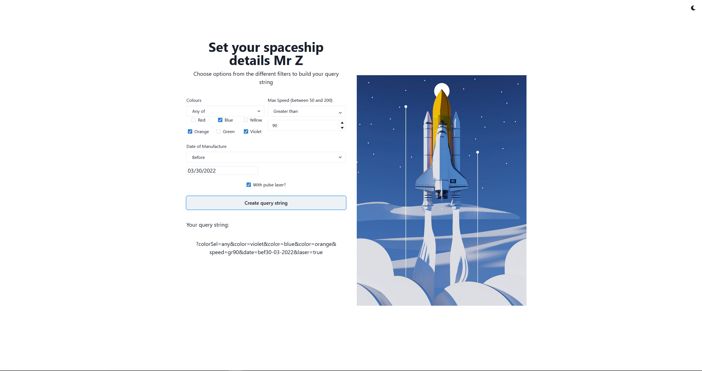

# Running the app

1. Open a new terminal and move to repository
2. Run command `npm install`
3. Run command `npm run start`
4. The app should automatically open in your preferred browser. If this does not happen, please go to http://localhost:3000/

## Notes

Should all work fine - date picker formatting could use a bit of work as well as some of the layout overall.

